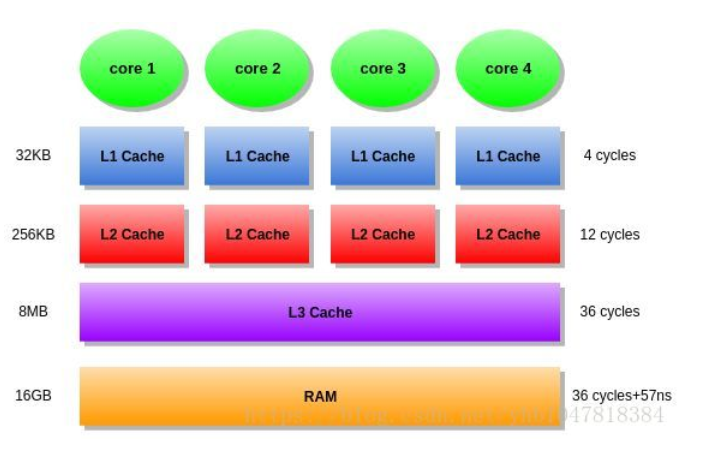

## MESI
现在多核 CPU 执行速度比主存数据快很多倍，并且通常会发生多个核心访问相同地址的数据,为了减缓延迟，增加内存总线的吞吐存在许多缓存协议。
### 1、带高速缓存的 CPU 基本计算流程
- 程序以及数据被加载到主存中
- 指令和数据被加载到 CPU 高速缓存中
- CPU 执行指令，将结果写回到高速缓存中
- 高速缓存中的数据写回到主存中

由于 CPU 的运算速度远大于1级缓存的数据IO速度，基于程序的局部性原理，现代 CPU 引入了多级缓存的结构。

Register -> L1 Cache -> L2 Cache -> L3 Cache -> Memory


基本交互流程：
CPU 接收到指令后，会去一级缓存中寻找数据，找不到则依次往下寻找。

什么是 cache line?
Cache Line 可以理解为 CPU 缓存中的最小单位。
内存与高速缓存以及高速缓存之间的数据移动不是以字节或者 word 为单位的，而是以缓存行为单位。一般的 64 位操作系统
缓存行大小为 64 字节。
```Bash
# 查看缓存行大小
cat /sys/devices/system/cpu/cpu1/cache/index0/coherency_line_size
```

cache line 在循环计算中的小影响
```C++
for (int i = 0; i < N; i+=k)
    arr[i] *= 3;
```
步长在1到 16 范围内，循环运行时间几乎不变。但从16开始，每次步长加倍，运行时间减半。
由于16个整型数占用 64 字节（一个缓存行），for循环步长在1到16之间必定接触到相同数目的缓存行：
即数组中所有的缓存行。 当步长为32，我们只有大约每两个缓存行接触一次，当步长为64，只有每四个接触一次。

### 2、缓存写机制
常见的缓存写机制有两种类型：
- write through(直写模式)：数据更新，同时写回到缓存和主存中
- write back(回写模式)：数据更新时候，只写入到缓存中，只有数据被替换出缓存的时候，被修改的数据才会被回到主存中

### 3、缓存一致性
多个处理器对某一个内存块同时读写的时候，会引起冲突，这被称为缓存一致性问题。
Cache 一致性问题出现的原因：多个核处理器都可以自己处理计算器指令，从而可能对一个内存块进行读写。但是由于回写
策略导致，一个内存块可能在处理器中有多个备份，有的已经写回到主存中，有的可能处于二级三级缓存中。

为了解决缓存一致性问题：CPU 硬件采用了 MESI 类似策略的协议进行缓存一致性处理。
- M: modify, 表示缓存中的数据已经更改,未来某一个时刻会写回到主存中
- E: exclusive, 表示缓存的数据只被当前的核心所缓存
- S: shared, 表示缓存的数据也被其他核心缓存
- I: invalid, 表示缓存中的数据已经失效，其他核心已经更改了数据

MESI 协议存在两个执行成本较大的操作：
- 将某一个缓存行标记为 invalid 状态
- 当某一个 Cache Line 当前状态为 invalid 时候写入数据
CPU 通过 Store Buffer 和 Invalidate Queue降低这类操作的延迟。

当一个核心在 invalid 状态下写入时，首先会给其他 CPU 核心发送 invalid 消息，然后把当前写入存储到
Store Buffer 中。然后异步在某一个时刻真正写入到 Cache Line 中。当前 CPU 如果要读取 Cache Line 中的
数据，需要先扫描 STore Buffer 之后再读取。但是此时其他 CPU 是看不到当前核心中的 Store Buffer 中的数据，
只有等到 Store Buffer 中的数据被刷新到 Cache Line 之后才会触发失效操作。(什么是失效操作？)

当一个 CPU 核心收到 invalid 消息之后，会把消息写入到自身的 invalidate queue 中，随后异步将之设置为 invalid
状态。当前 CPU 核心使用 Cache Line 的时候并不会扫描 invalidate queue。因此可能会短暂的出现脏读的问题。


